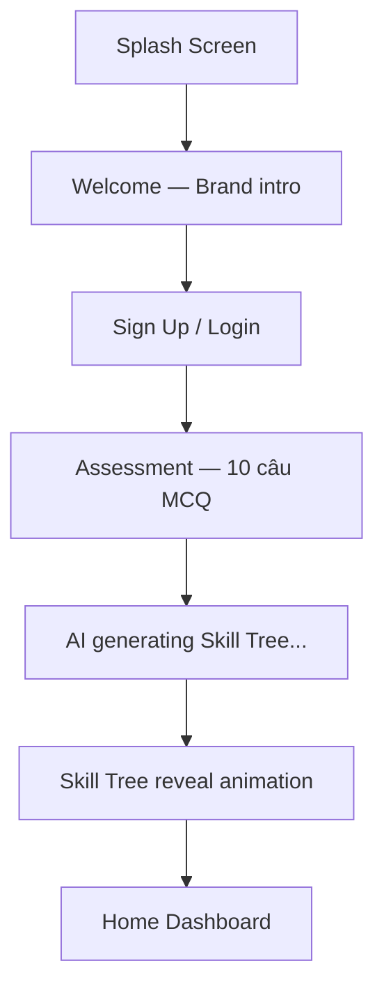
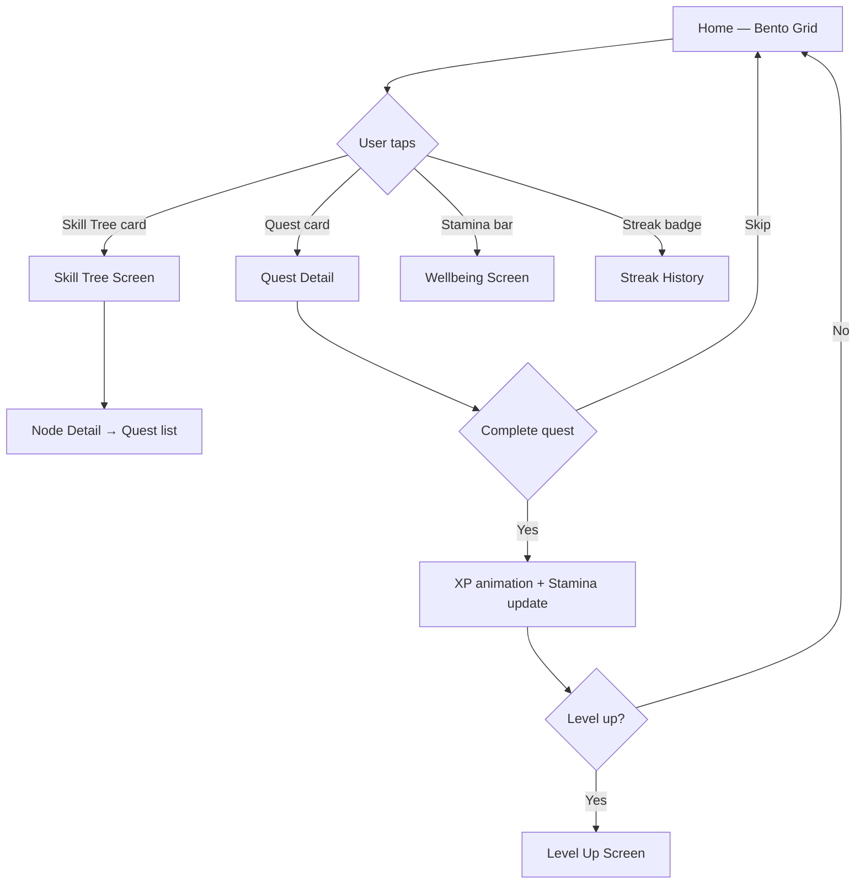
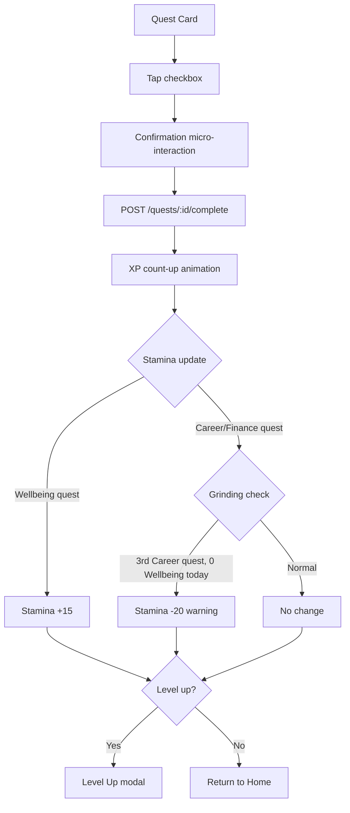
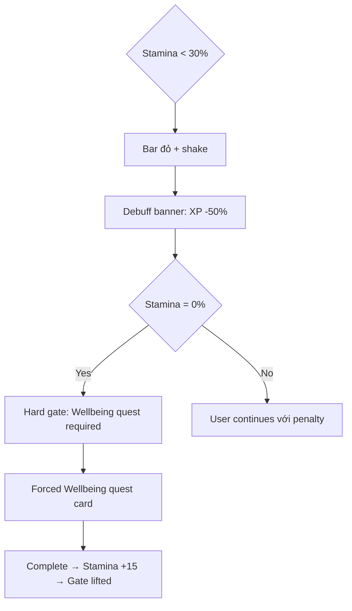

# Design System
**Ứng dụng:** Cây Kỹ Năng Cuộc Sống (Life Skill Tree)
**Platform:** React Native (Tamagui) — iOS first
**Cập nhật lần cuối:** 2026-03-17

---

## 1. Design Principles

Năm nguyên tắc định hướng mọi quyết định thiết kế:

| Nguyên tắc | Mô tả |
|---|---|
| **Calm by default** | Giao diện không gây lo lắng — đặc biệt quan trọng với module Wellbeing |
| **Progress is visible** | Người dùng luôn thấy mình đang tiến về phía trước, dù chỉ 1% |
| **Friction is intentional** | Chỉ tạo friction khi có mục đích (e.g. gate mentor bằng level) |
| **Reward the act, not the result** | Khen ngợi hành động hoàn thành, không so sánh với người khác |
| **Dark-first, eye-safe** | Dark mode là mặc định — Gen Z dùng app chủ yếu ban đêm |

---

## 2. Color System

### Base Palette

```
Background
  bg-base      : #0D0D0F   (near-black — màu nền chính)
  bg-surface   : #161618   (card, bottom sheet)
  bg-elevated  : #1E1E22   (modal, overlay)

Brand
  brand-primary : #7C6AF7   (tím lavender — màu chủ đạo)
  brand-glow    : #A89BFA   (lighter for highlights)

Accent (theo nhánh Skill Tree)
  career        : #4DA8FF   (xanh dương — Career/Tech)
  finance       : #34D399   (xanh lá — Finance)
  softskills    : #FBBF24   (vàng — Soft Skills)
  wellbeing     : #F472B6   (hồng — Mental Well-being)

State
  success       : #34D399
  warning       : #FBBF24
  danger        : #F87171
  stamina-low   : #F87171   (khi Stamina < 30%)
  stamina-mid   : #FBBF24   (khi Stamina 30–69%)
  stamina-ok    : #34D399   (khi Stamina ≥ 70%)

Text
  text-primary  : #F4F4F5
  text-secondary: #A1A1AA
  text-muted    : #52525B
```

### Glassmorphism Tokens

```
glass-bg      : rgba(255, 255, 255, 0.05)
glass-border  : rgba(255, 255, 255, 0.08)
glass-blur    : blur(20px)             — BackdropFilter
glass-shadow  : 0 8px 32px rgba(0,0,0,0.4)
```

### Adaptive Dark Mode
Hệ thống tự động điều chỉnh brightness dựa trên giờ thiết bị:
- 06:00–18:00 → `bg-base: #121214` (slightly lighter)
- 18:00–06:00 → `bg-base: #0D0D0F` (deeper dark)

---

## 3. Typography

```
Font family
  Display  : "Clash Display"  — headings, level names, XP counter
  Body     : "Inter"          — mọi text còn lại
  Mono     : "JetBrains Mono" — số liệu, stats, code-style labels

Scale (sp — React Native)
  display-xl  : 32sp / Bold    — màn hình splash, level-up
  display-lg  : 24sp / SemiBold— section headers
  title       : 20sp / SemiBold— card titles, screen titles
  body-lg     : 16sp / Regular — body text chính
  body        : 14sp / Regular — secondary text
  caption     : 12sp / Regular — labels, timestamps
  micro       : 10sp / Medium  — badges, tags
```

---

## 4. Spacing & Grid

```
Base unit: 4dp

Spacing scale:
  xs  :  4dp
  sm  :  8dp
  md  : 16dp
  lg  : 24dp
  xl  : 32dp
  2xl : 48dp
  3xl : 64dp

Screen padding  : 20dp (horizontal)
Card gap        : 12dp
Section gap     : 24dp
```

---

## 5. Bento Grid Layout

Màn hình Home (Dashboard) dùng **Bento Grid** — các card hình chữ nhật bất đối xứng, mỗi card là 1 module độc lập.

```
┌─────────────────┬──────────┐
│                 │  Streak  │  ← 2 col | 1 col
│  Skill Tree     │  🔥 12   │
│  Progress       ├──────────┤
│                 │ Stamina  │
│                 │ ██████░░ │
├────────┬────────┴──────────┤
│ Daily  │                   │
│ Quest  │   XP Progress     │  ← 1 col | 2 col
│  (3)   │   ▓▓▓▓▓▓░░  Lv4  │
└────────┴───────────────────┘
```

**Rules:**
- Grid 3 cột, mỗi cell = (screenWidth - 40) / 3
- Card chiếm 1, 2, hoặc 3 cột
- Tối thiểu 4dp khoảng cách giữa cards
- Không có row cố định — flow tự nhiên theo nội dung

---

## 6. Component Library (Tamagui)

### Core Components

#### `<SkillNode />`
```
Props:
  branch    : 'career' | 'finance' | 'softskills' | 'wellbeing'
  status    : 'locked' | 'in-progress' | 'completed'
  level     : number
  label     : string

States:
  locked     → Mờ (opacity 0.4), icon khóa, no tap
  in-progress→ Viền brand-primary + glow pulse animation
  completed  → Filled với accent màu nhánh + checkmark
```

#### `<QuestCard />`
```
Props:
  title     : string
  branch    : Branch
  xpReward  : number
  duration  : '5min' | '15min' | '30min'
  completed : boolean

Visual:
  Glass card + viền trái màu accent nhánh (4dp)
  XP badge góc phải trên
  Checkbox animation khi complete (spring + scale)
```

#### `<StaminaBar />`
```
Props:
  value     : number (0–100)

Visual:
  Thanh ngang, fill màu động theo threshold:
    ≥ 70% → stamina-ok (xanh lá)
    30–69% → stamina-mid (vàng) + pulse nhẹ
    < 30% → stamina-low (đỏ) + shake animation + warning icon
```

#### `<StreakBadge />`
```
Props:
  count     : number
  protected : boolean

Visual:
  🔥 icon + số ngày
  Khi count ≥ 7 → glow animation
  Khi protected → shield overlay nhỏ
```

#### `<XPProgressBar />`
```
Props:
  current   : number
  target    : number
  level     : number

Visual:
  Thanh fill + label "Lv.{n}" bên phải
  Animated fill khi XP thay đổi (spring easing)
  Level-up trigger: burst particle effect
```

#### `<BentoCard />`
```
Props:
  cols      : 1 | 2 | 3
  children  : ReactNode

Visual:
  Glass background + rounded-2xl (16dp)
  glass-border + glass-shadow
```

### Micro-interactions

| Trigger | Animation | Duration |
|---|---|---|
| Quest complete | Checkbox scale 1→1.3→1 + color fill | 300ms spring |
| XP gain | Number count-up + progress bar fill | 600ms ease-out |
| Level up | Full-screen burst + scale modal | 800ms |
| Skill node unlock | Glow pulse + border animate | 500ms |
| Stamina warning | Bar shake + color transition | 400ms |
| Streak milestone | 🔥 bounce + haptic medium | 350ms |

**Haptic feedback map:**
```
Quest complete   → Haptics.impactAsync(LIGHT)
Level up         → Haptics.notificationAsync(SUCCESS)
Stamina warning  → Haptics.notificationAsync(WARNING)
Streak milestone → Haptics.impactAsync(MEDIUM)
```

---

## 7. Screen Flows

### 7.1 Onboarding Flow



**Screen breakdown:**

| Screen | Key elements | Interaction |
|---|---|---|
| Splash | Logo animate-in, tagline | Auto-advance 2s |
| Welcome | Hero illustration + CTA | Tap to continue |
| Auth | Email / Google / Apple | Form + OAuth |
| Assessment | 1 câu/màn hình, progress bar | Swipe hoặc tap option |
| Generating | Lottie loading animation | Auto 2–3s |
| Tree Reveal | Skill Tree animate từ hạt → cây | Tap to explore |

---

### 7.2 Home Dashboard Flow



---

### 7.3 Quest Completion Flow



---

### 7.4 Stamina Warning Flow



---

## 8. Motion & Easing

```
spring-bounce  : { type: 'spring', stiffness: 300, damping: 20 }
spring-smooth  : { type: 'spring', stiffness: 200, damping: 30 }
ease-out-cubic : bezier(0.33, 1, 0.68, 1)
ease-in-out    : bezier(0.65, 0, 0.35, 1)

Durations:
  instant   :  0ms  (state changes)
  fast      : 150ms (micro feedback)
  normal    : 300ms (card transitions)
  slow      : 600ms (XP/progress)
  cinematic : 800ms (level up, onboarding reveal)
```

---

*Tài liệu này được reference bởi [[MVP_FEATURE_SCOPE]] và [[TECHNICAL_ARCHITECTURE]]*
*Dùng kèm [[PROMPT_DESIGN]] để generate UI với AI tools*
