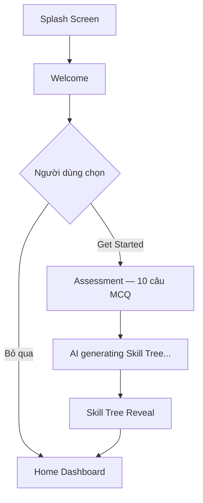
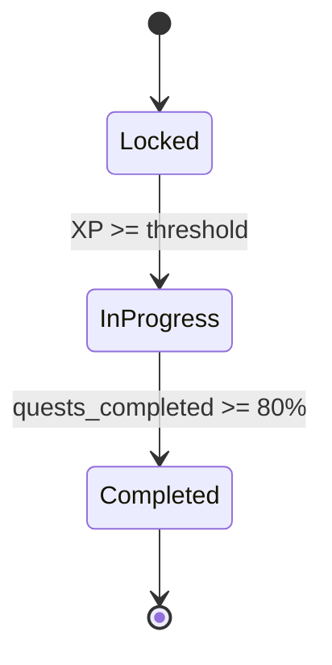
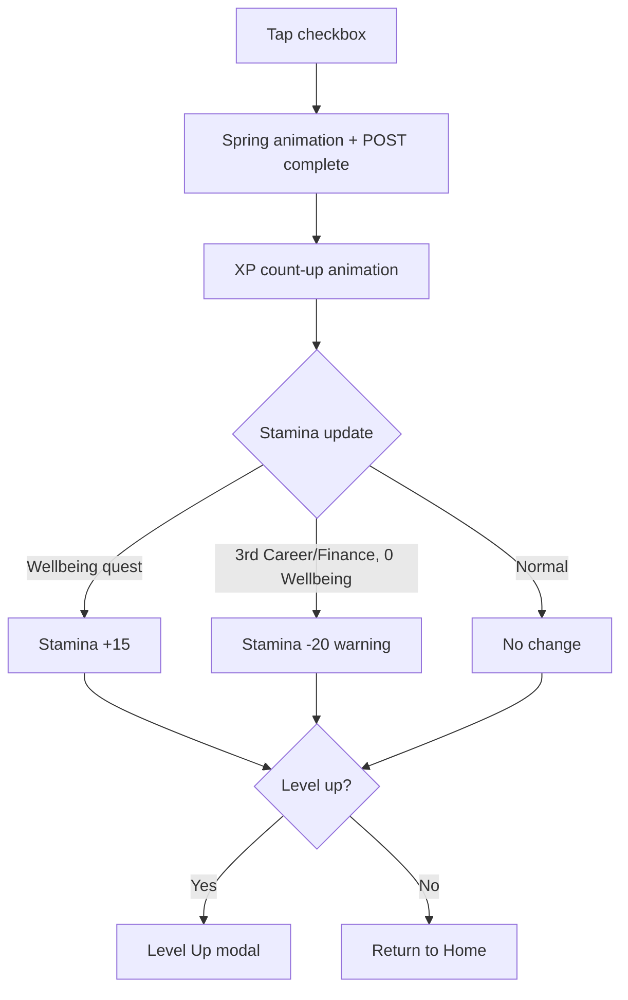

# PRD — Life Skill Tree (Cây Kỹ Năng Cuộc Sống)

**Version:** v1.0 — MVP
**Ngày tạo:** 2026-03-17
**Thị trường:** Việt Nam — Gen Z (18–27 tuổi)
**Platform:** React Native (Expo) — iOS first
**Mô hình:** Freemium + Premium (99k VND/tháng)
**Team:** 1–3 developers · 3–4 tháng

> **Tài liệu liên quan:** [[TECHNICAL_ARCHITECTURE]] · [[DESIGN_SYSTEM]] · [[PROMPT_DESIGN]] · [[MVP_FEATURE_SCOPE]]

---

## Mục lục

1. [[#1. Product Vision]]
2. [[#2. Feature Modules — P0 (MVP v1.0)]]
   - [[#2.1 Onboarding & Skill Tree Generation]]
   - [[#2.2 Life Skill Tree — Core UI]]
   - [[#2.3 Daily Quests]]
   - [[#2.4 XP & Stamina System]]
   - [[#2.5 Growth Streak]]
   - [[#2.6 Authentication & Profile]]
3. [[#3. Feature Modules — P1 (v1.1 — Tháng 4–6)]]
4. [[#4. Roadmap — P2 (v2.0 — Tháng 7+)]]
5. [[#5. Technical Summary]]
6. [[#6. MVP Delivery Checklist]]
7. [[#7. Quyết định Còn Mở]]

---

## 1. Product Vision

### 1.1 Vấn đề cần giải quyết

Thế hệ Z Việt Nam (18–27 tuổi) đang đối mặt với một nghịch lý: họ có đầy đủ thông tin về phát triển bản thân nhưng bị tê liệt trước các mục tiêu vĩ mô ("thành công", "tự do tài chính"). Không có công cụ nào kết hợp được cả ba nhu cầu cùng lúc:

- Phân rã mục tiêu lớn thành hành động nhỏ hàng ngày
- Duy trì động lực qua cơ chế gamification hiệu quả
- Bảo vệ sức khỏe tinh thần trong quá trình chạy đua

### 1.2 Giải pháp

Life Skill Tree là ứng dụng di động gamified kết hợp **RPG Skill Tree** với **wellness tracking**. Người dùng xây dựng "Cây Kỹ Năng" cá nhân hóa qua việc hoàn thành các nhiệm vụ hàng ngày (Quests), nhận XP để mở khóa kỹ năng, và duy trì **Thanh Năng Lượng (Stamina)** thể hiện sức khỏe tinh thần.

### 1.3 Core Loop

```
Onboard → Có Cây Kỹ Năng → Nhận Quest hàng ngày → Hoàn thành → XP + Stamina update → Quay lại ngày mai
```

### 1.4 Target Users

| Đặc điểm | Mô tả |
|---|---|
| Tuổi | 18–27 tuổi — sinh viên đại học, mới đi làm |
| Địa lý | Việt Nam (Phase 1), ưu tiên các thành phố lớn |
| Tâm lý | Lo lắng về tương lai, muốn phát triển nhưng không biết bắt đầu từ đâu |
| Hành vi số | Dùng Zalo, TikTok, YouTube hàng ngày; 87% đã dùng ChatGPT/Gemini |
| Nỗi đau | Cảm thấy bị áp đảo bởi mục tiêu lớn, dễ burnout, thiếu mentor |

---

## 2. Feature Modules — P0 (MVP v1.0)

> 🟢 **P0 = Must Have.** Không có những tính năng này, app không thể hoạt động.

---

### 2.1 Onboarding & Skill Tree Generation

#### Feature Overview

Người dùng trả lời ~10 câu hỏi trắc nghiệm (MCQ) ngắn để hệ thống tạo Cây Kỹ Năng cá nhân hóa. Mục tiêu: giảm friction tối đa trong lần đầu sử dụng, đồng thời thu thập đủ dữ liệu để khởi tạo skill tree phù hợp.

#### User Stories

- As a **new user**, I want to complete a short assessment, so that my Skill Tree reflects my actual goals.
- As a **user who is in a hurry**, I want to skip onboarding, so that I can set up my branches manually later.
- As a **user**, I want to see my personalized Skill Tree revealed after the assessment, so that I feel excited to start.

#### Acceptance Criteria

- [ ] Assessment gồm đúng 10 câu hỏi, mỗi câu trên một màn hình riêng biệt
- [ ] Có progress bar hiển thị tiến trình ("Câu 3/10")
- [ ] Người dùng có thể quay lại câu trước
- [ ] Nút "Bỏ qua" hiển thị ở câu đầu tiên — dẫn trực tiếp vào Home Dashboard
- [ ] Sau khi hoàn thành, hiển thị animation "Skill Tree đang được tạo..." (2–3 giây)
- [ ] Skill Tree Reveal screen hiển thị 4 nhánh với animation từ hạt giống nở thành cây

#### User Flow



#### Business Rules

- Nếu bỏ qua onboarding: mặc định mở 2 nhánh (Career + Wellbeing)
- Mỗi câu MCQ có 4 đáp án, mỗi đáp án map với 1 nhánh kỹ năng
- Không có "đáp án đúng/sai" — chỉ là preference mapping

#### Data Requirements

| Field | Type | Mô tả |
|---|---|---|
| `user_id` | UUID | Primary key |
| `onboarding_answers` | JSON Array | 10 câu trả lời |
| `skill_tree_config` | JSON | 4 nhánh + weights từ MCQ |
| `onboarding_skipped` | Boolean | |
| `onboarded_at` | Timestamp | |

---

### 2.2 Life Skill Tree — Core UI

#### Feature Overview

Màn hình chính của ứng dụng — hiển thị 4 nhánh kỹ năng dưới dạng cây/lưới với trạng thái locked/unlocked. Đây là "bản đồ tiến trình" trực quan của người dùng.

#### User Stories

- As a **user**, I want to see all 4 skill branches at a glance, so that I understand my overall progress.
- As a **user**, I want to see which nodes are locked/unlocked, so that I know what to work toward next.
- As a **user**, I want to tap a node to see related quests, so that I can take action immediately.

#### Acceptance Criteria

- [ ] 4 nhánh hiển thị: Career (xanh dương), Finance (xanh lá), Soft Skills (vàng), Wellbeing (hồng)
- [ ] Mỗi nhánh có 5–8 node trên 3 tầng: Beginner / Intermediate / Advanced
- [ ] Trạng thái node: Locked (mờ 40%, icon khóa) / In Progress (viền sáng + pulse) / Completed (filled + checkmark)
- [ ] Tap vào node In Progress → mở màn hình Quest list liên quan
- [ ] Tap vào node Locked → hiển thị "Cần X XP để mở khóa" tooltip
- [ ] Free tier: chỉ mở 2 nhánh. Premium: mở cả 4 nhánh

#### Node State Machine



| Trạng thái | Điều kiện | Visual |
|---|---|---|
| Locked | XP < threshold | Opacity 40%, lock icon |
| In Progress | Đã mở khóa, chưa hoàn thành | Glow border + pulse animation |
| Completed | Hoàn thành ≥ 80% quests của node | Solid fill + checkmark |

#### Business Rules

- Free tier: chỉ mở 2 nhánh. Premium: mở cả 4 nhánh
- Người dùng chỉ có thể có 1 node "In Progress" mỗi nhánh tại một thời điểm
- Unlock node tiếp theo khi đạt đủ XP threshold (xem [[#XP Economy]])

#### Data Requirements

| Field | Type | Mô tả |
|---|---|---|
| `node_id` | UUID | |
| `branch` | Enum | `career \| finance \| softskills \| wellbeing` |
| `tier` | Integer | 1 / 2 / 3 |
| `status` | Enum | `locked \| in_progress \| completed` |
| `xp_required` | Integer | XP cần để unlock |
| `quests_total` | Integer | |
| `quests_completed` | Integer | |

---

### 2.3 Daily Quests

#### Feature Overview

Mỗi ngày hệ thống giao 3–5 nhiệm vụ nhỏ (quests) tương ứng với các nhánh đang active. Đây là điểm chạm tương tác chính hàng ngày giữa người dùng và ứng dụng.

#### User Stories

- As a **user**, I want to receive 3–5 short daily quests, so that I always know what to do next.
- As a **user**, I want each quest to take 5–30 minutes, so that I can complete them even on busy days.
- As a **user**, I want to mark a quest as done with one tap, so that the action feels rewarding and frictionless.

#### Acceptance Criteria

- [ ] Mỗi ngày generate đúng 3 quests (Free) / 5 quests (Premium)
- [ ] Quests được phân bổ đều cho các nhánh đang active
- [ ] Mỗi quest có: title, branch tag, duration tag (5/15/30 min), XP reward badge
- [ ] Checkbox completion: tap một lần để confirm, có spring animation
- [ ] Quest đã hoàn thành: strikethrough + opacity giảm, không thể untick
- [ ] Quests reset lúc 00:00 (giờ Việt Nam, GMT+7)
- [ ] Nếu người dùng chưa hoàn thành quest cũ, nó biến mất (không tích lũy)

#### Quest Library Examples

| Nhánh | Ví dụ Quest |
|---|---|
| Career | "Đọc 1 bài về ngành bạn quan tâm trong 15 phút" · "Tìm 3 kỹ năng cần thiết cho vị trí bạn muốn" · "Cập nhật 1 mục trong CV" |
| Finance | "Ghi lại 3 khoản chi tiêu hôm nay" · "Lập budget cho tuần tới" · "Tính tỉ lệ tiết kiệm tháng này" |
| Soft Skills | "Viết 3 điều bạn đã làm tốt hôm nay" · "Luyện nói trước gương 5 phút" · "Viết tóm tắt 1 cuốn sách đã đọc" |
| Wellbeing | "Thực hiện 5 phút thở sâu có hướng dẫn" · "Viết 3 điều bạn biết ơn hôm nay" · "Đi bộ 10 phút không dùng điện thoại" |

#### Business Rules

- Nguồn quest MVP: thư viện ~200 quests AI-generated + human-reviewed (tiếng Việt)
- Phân bổ quest: rule-based, chưa dùng ML
- XP reward: Easy = +10 XP · Medium = +25 XP · Hard = +50 XP

#### Data Requirements

| Field | Type | Mô tả |
|---|---|---|
| `quest_id` | UUID | |
| `title` | String | Max 100 ký tự |
| `branch` | Enum | `career \| finance \| softskills \| wellbeing` |
| `difficulty` | Enum | `easy \| medium \| hard` |
| `duration_min` | Integer | 5 / 15 / 30 |
| `xp_reward` | Integer | 10 / 25 / 50 |
| `completed_at` | Timestamp | null nếu chưa hoàn thành |

---

### 2.4 XP & Stamina System

#### Feature Overview

Hệ thống XP và Stamina là trái tim của gamification. XP đo lường tiến trình kỹ năng; Stamina đo lường sức khỏe tinh thần và hoạt động như một cơ chế cân bằng tự động.

#### User Stories

- As a **user**, I want to earn XP for every quest I complete, so that I feel progress even before reaching real-world results.
- As a **user**, I want my Stamina to drop if I neglect Wellbeing quests, so that the app guides me toward balance.
- As a **user**, I want to see a clear warning when my Stamina is low, so that I know to take a break.

#### Acceptance Criteria

- [ ] XP hiển thị realtime sau khi hoàn thành quest (count-up animation)
- [ ] Level-up khi đạt đủ XP threshold — hiển thị Level Up modal
- [ ] Stamina bar hiển thị trên Home Dashboard, đổi màu theo ngưỡng
- [ ] Debuff XP áp dụng tự động khi Stamina < 30%
- [ ] Hard gate khi Stamina = 0%: Quest list chỉ hiển thị Wellbeing quests
- [ ] Cron job cập nhật Stamina lúc 23:59 GMT+7 mỗi ngày

#### XP Economy

**XP per quest:**

| Độ khó | Thời lượng | XP |
|---|---|---|
| Easy | 5–10 phút | +10 XP |
| Medium | 15–20 phút | +25 XP |
| Hard | 25–30 phút | +50 XP |

**XP cần để lên Level:**

| Level | XP Cần | Thời gian ước tính |
|---|---|---|
| 1 → 2 | 100 XP | ~4–5 ngày |
| 2 → 3 | 250 XP | |
| 3 → 4 | 500 XP | |
| 4 → 5 | 1,000 XP | ~1 tháng dùng đều |
| 5+ | +500 XP/level | Tuyến tính |

**Unlock theo Level:**

| Level | Phần thưởng |
|---|---|
| Level 2 | Unlock nhánh thứ 3 (Free tier) |
| Level 3 | Unlock Progress Analytics |
| Level 5 | Unlock Mentor System (v2.0) |
| Level 7 | Unlock Guild invite (v2.0) |

> ✅ XP không thể mua — chỉ nhận từ quests. Đây là tín hiệu chất lượng quan trọng với Mentor system.

#### Stamina Algorithm

Stamina là giá trị từ 0–100%, được cập nhật bởi cron job lúc 23:59 GMT+7 mỗi ngày:

| Điều kiện | Thay đổi Stamina | Ghi chú |
|---|---|---|
| Hoàn thành ≥ 1 Wellbeing quest | +15 (max 100) | Mỗi quest Wellbeing +15 |
| Bỏ qua toàn bộ Wellbeing quest | −10 / ngày | Decay cơ bản |
| ≥ 3 Career/Finance quests, 0 Wellbeing | −20 / ngày | "Grinding penalty" |

**Stamina threshold effects:**

| Ngưỡng | Trạng thái UI | Effect |
|---|---|---|
| 70–100% | Thanh xanh lá, bình thường | Không có hiệu ứng |
| 30–69% | Thanh vàng + pulse nhẹ | Cảnh báo UI |
| < 30% | Thanh đỏ + shake animation | Debuff: XP Career/Finance −50% |
| 0% | Thanh đỏ + icon cảnh báo | Hard gate: bắt buộc 1 Wellbeing quest trước |

#### User Flow — Quest Completion



#### Business Rules

- Stamina penalty (−50% XP) chỉ áp dụng cho Career/Finance XP, không áp dụng cho Wellbeing XP
- Stamina Hard Gate: nếu Stamina = 0%, Quest list chỉ hiển thị Wellbeing quests
- Nếu người dùng báo cáo mood "Rất tệ" **3 ngày liên tiếp** → hiển thị banner nhẹ nhàng + link đường dây hỗ trợ tâm lý Việt Nam (không interrupt flow)

> ⚠️ **Wellbeing Scope:** App chỉ hỗ trợ wellness phòng ngừa (stress nhẹ, burnout). KHÔNG đi sâu vào clinical mental health. Disclaimer bắt buộc: *"Ứng dụng này không thay thế tư vấn tâm lý chuyên nghiệp."*

---

### 2.5 Growth Streak

#### Feature Overview

Cơ chế giữ chân người dùng mỗi ngày thông qua áp lực tâm lý nhỏ nhưng liên tục. Người dùng duy trì "Chuỗi Phát Triển" bằng cách hoàn thành ít nhất 1 quest mỗi ngày.

#### User Stories

- As a **user**, I want to see my current streak count, so that I feel motivated to maintain it daily.
- As a **user**, I want a reminder before my streak breaks, so that I have a chance to save it.

#### Acceptance Criteria

- [ ] Streak tăng 1 khi hoàn thành ≥ 1 quest trong ngày (trước 23:59 GMT+7)
- [ ] Streak reset về 0 nếu bỏ 1 ngày
- [ ] Icon 🔥 + số ngày hiển thị nổi bật trên Home Dashboard
- [ ] Micro-interaction "Streak!" khi hoàn thành quest đầu tiên trong ngày
- [ ] Streak milestone: badge đặc biệt vào ngày 7, 14, 30, 60, 100
- [ ] Push notification nhắc lúc 20:00 nếu chưa hoàn thành quest nào trong ngày

#### Business Rules

- Không có grace period ở v1
- Streak Shield (1 lần/tuần, Premium) → defer sang v1.1

---

### 2.6 Authentication & Profile

#### Acceptance Criteria

- [ ] Đăng ký / đăng nhập qua: Email + mật khẩu, Google OAuth, Apple Sign-In
- [ ] Apple Sign-In bắt buộc khi có social login trên iOS (App Store policy)
- [ ] Profile hiển thị: avatar, tên, level, tổng XP, streak hiện tại, streak tốt nhất
- [ ] 4 thanh progress nhánh kỹ năng (Career/Finance/Soft Skills/Wellbeing)
- [ ] Stats grid: số quests hoàn thành, số ngày hoạt động, best streak, số nhánh active

---

## 3. Feature Modules — P1 (v1.1 — Tháng 4–6)

> 🟡 **P1 = Should Have.** Quan trọng cho retention, nhưng không blocking launch.

### 3.1 Freemium Gate & Premium Subscription

| Tính năng | Free | Premium (99k VND/tháng) |
|---|---|---|
| Số nhánh Skill Tree | 2 nhánh | 4 nhánh |
| Quest mỗi ngày | 3 quests | 5 quests |
| Streak Shield | ❌ | ✅ 1 lần/tuần |
| Phân tích tiến trình | 7 ngày | 30 ngày + biểu đồ |
| Early access features | ❌ | ✅ |

**Pricing:** 99k VND/3 tháng đầu (intro offer) → 99k VND/tháng thường. Quản lý qua **RevenueCat**.

### 3.2 Progress Analytics

- Biểu đồ XP theo tuần (bar chart)
- % hoàn thành mỗi nhánh kỹ năng
- Lịch sử streak (calendar heatmap)
- So sánh tuần này vs tuần trước

### 3.3 Push Notifications

| Loại thông báo | Trigger |
|---|---|
| Streak reminder | 20:00 mỗi ngày nếu chưa có quest nào hôm nay |
| Stamina cảnh báo | Khi Stamina < 30% sau cron job |
| Streak milestone | Đạt mốc 7, 14, 30, 60, 100 ngày |
| Weekly summary | Thứ Hai sáng: tổng kết tuần trước |

---

## 4. Roadmap — P2 (v2.0 — Tháng 7+)

> 🔵 **P2 = Nice to Have.** Cần product-market fit trước.

| Module | Mô tả | Điều kiện mở khóa |
|---|---|---|
| Mentor Unlock System | Kết nối với mentor ngành khi đạt Level 5 | PMF + xây dựng mạng lưới mentor |
| Guild System | Nhóm 5–10 người, weekly team challenge | Đủ user base cho network effect |
| AI Personalization | NLP phân tích mood, predictive burnout detection | 3–6 tháng data người dùng thật |
| Chat UI / AI Companion | Check-in hàng ngày qua AI chat | Chọn được LLM phù hợp |

### Features đã cắt khỏi Roadmap

| Tính năng | Lý do cắt |
|---|---|
| Bảng xếp hạng công khai | Rủi ro toxic competition, cần moderation |
| Tích hợp third-party (Spotify, Health app) | Tăng scope quá nhiều |
| Content marketplace | Cần network effect trước |
| Web version | Mobile-first, tiết kiệm resource |

---

## 5. Technical Summary

> Chi tiết đầy đủ tại [[TECHNICAL_ARCHITECTURE]]

| Layer            | Công nghệ               | Ghi chú                           |
| ---------------- | ----------------------- | --------------------------------- |
| Mobile Framework | React Native (Expo SDK) | iOS first, Android Phase 2        |
| UI Library       | Tamagui                 | Atomic design pattern             |
| Navigation       | React Navigation v7     |                                   |
| Auth             | Supabase Auth           | Email + Google + Apple Sign-In    |
| State            | Zustand                 |                                   |
| API Client       | Axios + TanStack Query  |                                   |
| Backend          | Node.js + Fastify       | Hoặc NestJS nếu team mở rộng      |
| Database         | PostgreSQL via Supabase |                                   |
| Cache            | Redis (Upstash)         | Streak, Stamina, daily quest pool |
| Payment          | RevenueCat              | iOS + Android subscription        |
| Hosting          | Self-host               | Owner có DevOps skills            |
| OTA Updates      | Expo Updates            | Không cần re-submit store         |

### Core API Endpoints

```
POST /auth/login                    — Đăng nhập, trả về JWT
GET  /users/:id/skill-tree          — Lấy toàn bộ Skill Tree của user
GET  /quests/daily                  — Lấy danh sách quests hôm nay
POST /quests/:id/complete           — Ghi nhận hoàn thành, tính XP + Stamina
GET  /users/:id/progress            — XP, level, streak, stamina hiện tại
POST /users/:id/mood-checkin        — Ghi nhận trạng thái tâm lý hàng ngày
```

---

## 6. MVP Delivery Checklist

- [ ] Onboarding flow (10 câu MCQ → Skill Tree reveal)
- [ ] 4-nhánh Skill Tree UI (locked / in-progress / completed)
- [ ] Thư viện 200 quests (AI-generated + human-reviewed, tiếng Việt)
- [ ] Daily quest assignment (rule-based, reset 00:00 GMT+7)
- [ ] XP system + level-up animation
- [ ] Stamina bar + decay/recovery cron job (23:59 GMT+7)
- [ ] Growth Streak counter + milestone notifications
- [ ] Auth (Email + Google + Apple Sign-In)
- [ ] Basic profile page
- [ ] Wellbeing disclaimer + hotline redirect (trigger 3 ngày liên tiếp)
- [ ] Push notification (streak reminder lúc 20:00)
- [ ] RevenueCat: 99k/3 tháng intro → 99k/tháng

---

## 7. Quyết định Còn Mở

| # | Quyết định | Options | Ưu tiên |
|---|---|---|---|
| T1 | Backend framework | Fastify (lightweight) vs NestJS (structured) | 🟡 High |
| T3 | LLM quest generation | mlx-lm local (cost = 0) vs OpenAI API (dễ scale) | 🟠 Defer |
| P6 | Wellbeing threshold | Bao nhiêu ngày "rất tệ" liên tiếp thì hiện hotline? | 🟠 Medium |
| P7 | Mentor compensation | Tiền mặt, credit trong app, hay volunteer? | 🔵 Defer v2.0 |

---

*Generated: 2026-03-17 · Life Skill Tree PRD v1.0*
*Ref: [[BRIEF]] · [[MVP_FEATURE_SCOPE]] · [[TECHNICAL_ARCHITECTURE]] · [[DESIGN_SYSTEM]] · [[PROMPT_DESIGN]]*
